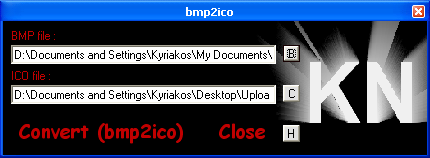



## Easy bmp2ico

### Description

This is a small example showing how to convert bitmap images to icon images.

Easy to make Very Easy to use...

If you have any errors on the program or you want to make a suggestion on it

please contact me at kyriakosnicola@yahoo.com
 
### More Info
 

             |
---                |---
**Submitted On**   |2002-11-18 13:14:38
**By**             |[Kyriakos Nicola](https://github.com/Planet-Source-Code/PSCIndex/blob/master/ByAuthor/kyriakos-nicola.md)
**Level**          |Beginner
**User Rating**    |4.7 (14 globes from 3 users)
**Compatibility**  |VB 5\.0, VB 6\.0
**Category**       |[Graphics](https://github.com/Planet-Source-Code/PSCIndex/blob/master/ByCategory/graphics__1-46.md)
**World**          |[Visual Basic](https://github.com/Planet-Source-Code/PSCIndex/blob/master/ByWorld/visual-basic.md)
**Archive File**   |[Easy\_bmp2i14994911182002\.zip](https://github.com/Planet-Source-Code/kyriakos-nicola-easy-bmp2ico__1-40839/archive/master.zip)

